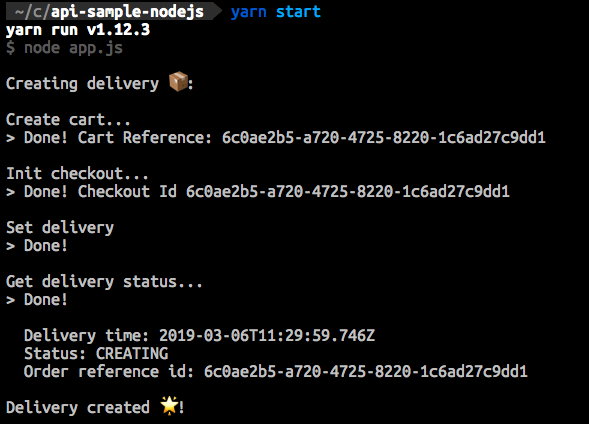

# NodeJS sample code for calling Urb-it Delivery API

## Important

This is sample code for integrating and calling the Urb-it Delivery API. The purpose is to give some inspiration on how you could integrate with the API and some of the steps required. The code only covers how to create a delivery and it's not written in a production ready way (no error handling, no logging, code duplication, etc).

This code will:

1. Create a delivery, in our sandbox (test) environment, for the _Paris market_ with a _specific delivery time_
1. Get the status for the created delivery

## Documentation

Urb-it Delivery API Documentation: http://developer.urb-it.com

## Prerequisites

1. A contract with Urb-it (support@urbit.com)
1. API Key and Auth Token (this will be given to you by you sales representative)
1. NodeJS and Yarn

## Installation

1. Run `yarn install`
1. Run `yarn env` (or `yarn env-win` if you are running windows)
1. Update .env file with you API Key and Auth Token (see Prerequisites)

## Default market

Out of the box this code create deliveries for the Paris market. To create deliveries for other markets, please update the `recipient` delivery address in `set-delivery.js`.

## Running

1. Run `yarn start`
1. If everything is configured correctly, you should have created an order in our sandbox (test) environment:

## Disclaimer

THE SOFTWARE IS PROVIDED "AS IS", WITHOUT WARRANTY OF ANY KIND, EXPRESS OR IMPLIED, INCLUDING BUT NOT LIMITED TO THE WARRANTIES OF MERCHANTABILITY, FITNESS FOR A PARTICULAR PURPOSE AND NONINFRINGEMENT. IN NO EVENT SHALL THE AUTHORS OR COPYRIGHT HOLDERS BE LIABLE FOR ANY CLAIM, DAMAGES OR OTHER LIABILITY, WHETHER IN AN ACTION OF CONTRACT, TORT OR OTHERWISE, ARISING FROM, OUT OF OR IN CONNECTION WITH THE SOFTWARE OR THE USE OR OTHER DEALINGS IN THE SOFTWARE.
